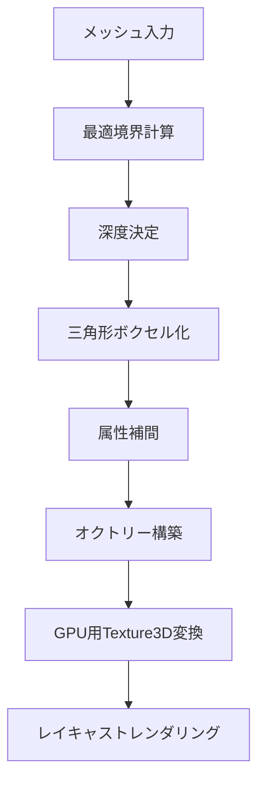

# Unity Sparse Voxel Octrees (SVO) - 詳細解説

Unity向けのSparse Voxel Octree（疎ボクセルオクトリー）実装です。[Nvidia論文: "Efficient Sparse Voxel Octrees – Analysis, Extensions, and Implementation"](https://www.nvidia.com/docs/IO/88972/nvr-2010-001.pdf)の手法に基づいて開発されています。

## 📖 目次

1. [SVO処理の概要](#svo処理の概要)
2. [ボクセルデータ構造](#ボクセルデータ構造)
3. [座標管理システム](#座標管理システム)
4. [メッシュ頂点生成](#メッシュ頂点生成)
5. [メモリ効率最適化](#メモリ効率最適化)
6. [並列化技術](#並列化技術)
7. [コライダー実装提案](#コライダー実装提案)
8. [スクリプト構成](#スクリプト構成)
9. [インストール・使用方法](#インストール使用方法)

---

## 🔍 SVO処理の概要

### Sparse Voxel Octreeとは

Sparse Voxel Octree（SVO）は、3D空間を効率的に表現するデータ構造です：

- **階層構造**: 3D空間を8つの子ノードに再帰的に分割
- **疎な表現**: 空のボクセルは格納せず、メモリ使用量を大幅削減
- **動的深度**: 必要な場所のみ高解像度で表現
- **GPU最適化**: レイキャスト処理をGPU並列実行

### 処理フロー



---

## 🏗️ ボクセルデータ構造

### ノード構造

```csharp
// 32bit整数によるノード表現
// bit 31: ノードタイプ (0=ポインタ, 1=ボクセル)
// bit 30-0: データポインタまたは属性データ参照

int nodeData = (nodeType << 31) | dataReference;
```

### 階層構造

```
ルートノード
├── 子ノード [0,0,0]
├── 子ノード [0,0,1]
├── 子ノード [0,1,0]
├── 子ノード [0,1,1]
├── 子ノード [1,0,0]
├── 子ノード [1,0,1]
├── 子ノード [1,1,0]
└── 子ノード [1,1,1]
```

### 属性データ形式

```csharp
// 属性データレイアウト
[メタデータ+RGB色][法線エンコード][カスタム属性1][カスタム属性2]...

// メタデータ部分 (32bit)
// bit 31-24: 属性データ長
// bit 23-16: Red (8bit)
// bit 15-8:  Green (8bit)
// bit 7-0:   Blue (8bit)
```

---

## 🎯 座標管理システム

### 座標系変換

1. **ワールド座標 → オクトリー座標**
   ```csharp
   Vector3 octreeCoord = (worldPos - octreeCenter) / octreeSize;
   // 結果: [-0.5, 0.5] 範囲
   ```

2. **オクトリー座標 → 内部正規化座標**
   ```csharp
   Vector3 normalizedCoord = octreeCoord + Vector3.one * 1.5f;
   // 結果: [1.0, 2.0] 範囲
   ```

### 高速ビット操作による座標計算

```csharp
// IEEE 754浮動小数点のビット表現を直接操作
unsafe int AsInt(float f) => *(int*)&f;

// 各軸の子ノードインデックス計算
var xm = (AsInt(position.x) >> (23 - depth)) & 1;
var ym = (AsInt(position.y) >> (23 - depth)) & 1;
var zm = (AsInt(position.z) >> (23 - depth)) & 1;
var childIndex = (xm << 2) + (ym << 1) + zm;
```

### 走査最適化

- **ポインタスタック**: 前回のアクセス位置を記憶
- **差分計算**: 共通の親ノードから走査開始
- **O(log n)最適化**: 隣接ボクセルへの高速アクセス

---

## 🔺 メッシュ頂点生成

### 三角形ボクセル化プロセス

```csharp
// 1. 三角形-ボックス交差判定
if (TriBoxOverlap.IsIntersecting(bounds, vertices))
{
    // 2. 再帰的空間分割
    for (var i = 0; i < 8; i++)
    {
        // 子空間での処理
        FillRecursively(currentDepth + 1, childBounds);
    }
}
```

### 属性補間技術

```csharp
// 重心座標による高精度補間
var barycentric = OctreeMath.ToBarycentricCoordinates(
    voxelCenter, vertex1, vertex2, vertex3);

// UV座標補間
var interpolatedUV = barycentric.x * uv1 + 
                    barycentric.y * uv2 + 
                    barycentric.z * uv3;

// 法線補間
var interpolatedNormal = barycentric.x * normal1 + 
                        barycentric.y * normal2 + 
                        barycentric.z * normal3;
```

### 法線圧縮技術 (Cube Mapping)

```csharp
// 32bitへの法線圧縮
// 主軸特定 → 2成分のみ格納 → 10bit精度で量子化
var maxAbsComp = Mathf.Max(Mathf.Abs(normal.x), 
                          Mathf.Abs(normal.y), 
                          Mathf.Abs(normal.z));
var cubicNormal = normal / maxAbsComp;
```

---

## ⚡ メモリ効率最適化

### 1. フリープールシステム

```csharp
// 削除されたメモリブロックを再利用
private readonly HashSet<int> _freeStructureMemory = new HashSet<int>();
private readonly HashSet<int> _freeAttributeMemory = new HashSet<int>();

// 同サイズブロックの優先再利用
foreach (var ptr in _freeAttributeMemory)
{
    var size = (uint)_data[ptr] >> 24;
    if (size == attributes.Count)
    {
        // 再利用可能なブロックを発見
        ReuseMemoryBlock(ptr, attributes);
        return ptr;
    }
}
```

### 2. 差分更新システム

```csharp
// GPUへの差分転送
for (var i = 0; i < depth; i++)
{
    if (_lastApply[i] == _updateCount[i])
        continue; // このスライスは更新不要
    
    // 変更されたスライスのみを転送
    TransferSliceToGPU(i);
}
```

### 3. メモリ連続性最適化

```csharp
// Rebuild()による断片化解消
void RebuildBranch(int referenceBranchPtr)
{
    // 深度優先でメモリを連続配置
    // キャッシュ効率とアクセス性能を向上
}
```

### メモリ使用量予測

| 深度 | ボクセル数 | 理論最大メモリ | 実効メモリ(疎) |
|------|------------|---------------|----------------|
| 8    | 256³       | 256MB         | ~10MB          |
| 10   | 1024³      | 4GB           | ~100MB         |
| 12   | 4096³      | 64GB          | ~1GB           |

---

## 🚀 並列化技術

### CPU並列化

```csharp
// 三角形単位での並列処理
Parallel.ForEach(triangles, triangle =>
{
    // 各三角形を独立してボクセル化
    ProcessTriangle(triangle);
});

// サブメッシュ単位での並列処理
Parallel.For(0, mesh.subMeshCount, submesh =>
{
    ProcessSubmesh(submesh);
});
```

### GPU並列レイキャスト

```hlsl
// GPU Shader内での並列レイキャスト
bool cast_ray(ray ray, Texture3D<int> volume, ...)
{
    // 複数ピクセルで同時実行
    // ワープ内での効率的な分岐処理
    // テクスチャキャッシュの最適活用
}
```

### 並列化最適化のポイント

1. **データ競合回避**: 各三角形が独立したボクセル領域を処理
2. **メモリアクセス最適化**: 空間局所性を考慮した分割
3. **GPU転送最適化**: バッチ処理による転送効率向上

---

## 🛡️ コライダー実装提案

現在の実装にはコライダー機能がありませんが、以下の手法で実装可能です：

### 1. ボクセルベースコライダー

```csharp
public class SVOCollider : MonoBehaviour
{
    private Octree octree;
    private int collisionDepth = 6; // 適度な解像度
    
    // 点との衝突判定
    public bool ContainsPoint(Vector3 worldPoint)
    {
        // オクトリー座標に変換
        var localPoint = transform.InverseTransformPoint(worldPoint);
        
        // ボクセル存在チェック
        return CheckVoxelExists(localPoint, collisionDepth);
    }
    
    // レイキャスト
    public bool Raycast(Ray ray, out RaycastHit hit)
    {
        if (octree.CastRay(ray, transform, out RayHit octreeHit))
        {
            // UnityのRaycastHitに変換
            hit = ConvertToRaycastHit(octreeHit);
            return true;
        }
        hit = default;
        return false;
    }
}
```

### 2. 近似メッシュコライダー

```csharp
// 低解像度ボクセルからメッシュ生成
public Mesh GenerateCollisionMesh(int resolution = 4)
{
    var vertices = new List<Vector3>();
    var triangles = new List<int>();
    
    // Marching Cubesアルゴリズムでメッシュ生成
    for (int x = 0; x < resolution; x++)
    {
        for (int y = 0; y < resolution; y++)
        {
            for (int z = 0; z < resolution; z++)
            {
                GenerateCube(x, y, z, vertices, triangles);
            }
        }
    }
    
    return new Mesh { vertices = vertices.ToArray(), triangles = triangles.ToArray() };
}
```

### 3. 階層的コライダー

```csharp
// 粗い判定 → 詳細判定の階層化
public class HierarchicalSVOCollider
{
    private Octree octree;
    private BoxCollider[] coarseColliders; // 粗い判定用
    
    private void Start()
    {
        // 深度2-3でのボックスコライダー配列を生成
        GenerateCoarseColliders();
    }
    
    public bool CheckCollision(Collider other)
    {
        // 1. 粗い判定
        foreach (var coarse in coarseColliders)
        {
            if (coarse.bounds.Intersects(other.bounds))
            {
                // 2. 詳細判定
                return DetailedCollisionCheck(other, coarse.bounds);
            }
        }
        return false;
    }
}
```

### 実装推奨事項

1. **用途別最適化**:
   - 物理演算: 低解像度近似メッシュ
   - トリガー判定: ボクセルベース高速判定
   - 精密衝突: 階層的判定

2. **パフォーマンス調整**:
   - コライダー専用深度設定（通常4-6）
   - 動的LOD（距離に応じた解像度変更）
   - 非同期更新（メッシュ変更時の段階的更新）

---

## 📁 スクリプト構成

### コアクラス

| ファイル | 役割 | 主要機能 |
|----------|------|----------|
| `Octree.cs` | メインオクトリークラス | ・ボクセル設定・削除<br>・メモリ管理<br>・GPU変換<br>・レイキャスト |
| `MeshToOctree.cs` | メッシュ変換基底クラス | ・境界計算<br>・三角形ボクセル化<br>・座標変換 |
| `MeshToOctreeStandard.cs` | 標準メッシュ変換 | ・UV補間<br>・法線補間<br>・テクスチャサンプリング |
| `AttributeEncoder.cs` | 属性エンコーダー | ・法線圧縮<br>・32bit最適化 |

### ユーティリティ

| ファイル | 役割 | 主要機能 |
|----------|------|----------|
| `OctreeMath.cs` | 数学計算 | ・重心座標<br>・三角形面積<br>・数値微分 |
| `TriBoxOverlap.cs` | 交差判定 | ・三角形-ボックス判定 |
| `RayHit.cs` | レイキャスト結果 | ・衝突情報格納 |

### GPU処理

| ファイル | 役割 | 主要機能 |
|----------|------|----------|
| `GeometryRayCast.hlsl` | GPUレイキャスト | ・並列レイ追跡<br>・交差計算<br>・属性デコード |
| `OctreeSimple.shader` | 描画シェーダー | ・ボクセル描画<br>・ライティング |
| `Util.hlsl` | GPU共通処理 | ・座標変換<br>・ユーティリティ |

### エディター拡張

| ファイル | 役割 | 主要機能 |
|----------|------|----------|
| `MeshToOctreeEditor.cs` | エディター機能 | ・GUI提供<br>・変換実行 |
| `OctreeRendererFeature.cs` | レンダーパイプライン | ・描画統合 |

---

## 🚀 インストール・使用方法

### インストール

1. **プロジェクト設定**
   ```
   Project Settings > Player > Other Settings > Allow 'unsafe' Code ☑
   ```

2. **ファイル配置**
   ```
   Assets/
   └── SVO/
       ├── Octree.cs
       ├── MeshToOctree/
       ├── Utils/
       └── Shaders/
   ```

### 基本使用方法

```csharp
using SVO;

public class SVOExample : MonoBehaviour
{
    void Start()
    {
        // 1. オクトリー作成
        var octree = new Octree();
        
        // 2. ボクセル設定
        octree.SetVoxel(
            position: Vector3.zero,
            depth: 8,
            color: Color.red,
            attributes: AttributeEncoder.EncodeStandardAttributes(Vector3.up)
        );
        
        // 3. GPU用テクスチャに変換
        var texture3D = octree.Apply();
        
        // 4. マテリアルに適用
        material.mainTexture = texture3D;
        
        // 5. 最適化（オプション）
        octree.Rebuild();
    }
}
```

### メッシュからの変換

```csharp
// GameObjectにMeshToOctreeStandardをアタッチ
var converter = gameObject.AddComponent<MeshToOctreeStandard>();
converter.mesh = GetComponent<MeshFilter>().mesh;
converter.voxelSize = 0.1f;
converter.material = GetComponent<Renderer>().material;

// 変換実行
converter.Generate();
```

### パフォーマンス設定

```csharp
// メモリ効率重視
octree.Rebuild(); // 定期的な最適化

// 描画品質重視
var highResTexture = octree.Apply(tryReuseOldTexture: false);

// バランス型
var balancedTexture = octree.Apply(tryReuseOldTexture: true);
```

---

## 📊 パフォーマンス特性

### 計算量

| 操作 | 計算量 | 備考 |
|------|--------|------|
| ボクセル設定 | O(log n) | ポインタスタック最適化 |
| レイキャスト | O(log n) | GPU並列実行 |
| メモリ再構築 | O(n) | 断片化解消 |
| GPU転送 | O(Δn) | 差分更新 |

### 最適化のポイント

1. **適切な深度設定**: 用途に応じた解像度選択
2. **定期的なRebuild**: メモリ断片化の解消
3. **バッチ処理**: 複数ボクセルの一括更新
4. **キャッシュ活用**: 空間局所性の考慮

---

## 🔮 今後の拡張予定

- **物理演算統合**: Unityコライダーとの完全統合
- **動的変形**: リアルタイムボクセル変更
- **マルチスレッド**: CPU並列化の拡張
- **圧縮最適化**: より効率的な属性エンコーディング
- **シャドウ対応**: 影描画機能の追加

---

## 📝 制限事項

- **変形非対応**: 頂点変形アニメーションは未実装
- **コライダー未実装**: 近似コライダーの手動実装が必要
- **シャドウ未対応**: 影描画は未実装
- **メモリ制限**: 深度12を超える場合はメッシュ分割を推奨

---

## 🔗 参考資料

- [Nvidia SVO論文](https://www.nvidia.com/docs/IO/88972/nvr-2010-001.pdf)
- [デモプロジェクト](https://github.com/BudgetToaster/unity-svo-demo)
- [Octree理論解説](https://en.wikipedia.org/wiki/Octree)
- [レイキャスト最適化](https://research.nvidia.com/publication/2010-02_Efficient-Sparse-Voxel)

---

*Unity Sparse Voxel Octrees - 高性能ボクセルレンダリングシステム*
